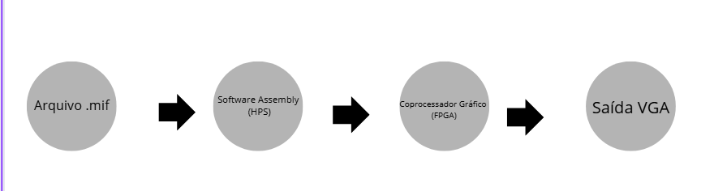

# Problema 2 – Integração da API em Assembly com o coprocesador gráfico
<h2>Descrição do Projeto</h2>

Esse projeto teve como objetivo o desenvolvimento de um módulo para redimensionamento de imagens(zoom e downscale) em um sistema de vigilância de tempo real, utilizando a placa DE1-SoC. 

  Na primeira etapa, foi implementado um coprocessador gráfico na FPGA responsável por aplicar os algoritmos de redimensionamento de imagem. No entanto, o redimensionamento era feito por meio de chaves e botões físicos e o carregamento da imagem original na memória por módulos pré definidos no IP Catalog.

  A segunda etapa, descrita neste repositório, tem como objetivo automatizar esse controle por meio de software, integrando o Hard Processor System (HPS) ao coprocessador via ponte Avalon (FPGA–HPS). Para isso, foi desenvolvida uma API em Assembly ARM, que envia instruções e dados diretamente à FPGA por meio de endereços mapeados em memória

     
    <strong>Diagrama introdutório do caminho tomado pelo programa após a API.</strong>  
  

  <h2>Arquitetura e integração do projeto com a API(HPS)</h2>
  

    Na segunda etapa, o principal objetivo foi integrar o processador ARM (HPS) da DE1-SoC com o coprocessador gráfico implementado na FPGA. A comunicação, antes era feita por meio de chaves e botões físicos, além do fato da imagem ser carregada na memória por módulos definidos dentro da IDE Quartus. No projeto atual, essas definições passaram a ocorrer de forma totalmente programável através de uma API escrita em Assembly ARMv7, que acessa diretamente os periféricos da FPGA por meio do barramento AXI Lightweight (AXI-LW).
  

  <h3> Arquitetura Geral da API
  </h3>
  

    A arquitetura da API permite que o software em Assembly ArmV7 executando no HPS, controle as operações do coprocessador gráfico (implementado em hardware na FPGA).
  

  
O HPS é responsável por:

  
-> Carregar a imagem .mif para uma RAM.

  
-> Mapear o barramento AXI-LW, obtendo o endereço virtual dos periféricos da FPGA.

  
-> Transferir os dados da imagem para a região de memória compartilhada entre coprocessador e HPS.

  
-> Enviar instruções de controle para o coprocessador (como zoom, redução, média, etc.).

  
-> Aguardar o término do processamento e liberar recursos.

  
A comunicação entre as partes é feita por PIOs(Parallel I/O) configurados no Platform Designer, que são mapeados em endereços físicos dentro do espaço do LW Bridge (0xFF200000).

  

     
    <strong>Fluxo de operação.</strong>  
  

  <h3>Fluxo de Execução</h3> 
 O funcionamento completo da integração entre o HPS (ARM) e a FPGA pode ser descrito em seis etapas principais, desde o carregamento da imagem até a execução do comando pelo coprocessador gráfico. 
 
<strong>1. Mapeamento da Ponte (<i>mapearPonte</i>)</strong>  O programa em Assembly cria um acesso virtual à área de memória da FPGA por meio da ponte <strong>AXI Lightweight (AXI-LW)</strong>. Dessa forma, os endereços físicos dos periféricos passam a ser acessíveis diretamente pelo software, permitindo o controle do hardware através de ponteiros como <code>CONTROL_PIO_ptr</code> e <code>IMAGE_MEM_ptr</code>. 
 
<strong>2. Leitura da Imagem (<i>carregarImagemMIF</i>)</strong>  A rotina lê o arquivo de imagem no formato <strong>.mif</strong>, converte seus valores hexadecimais em bytes de 8 bits e os armazena em um buffer na RAM do HPS. Essa etapa prepara os dados que serão enviados para o coprocessador. 
 
<strong>3. Transferência para a FPGA (<i>transferirImagemFPGA</i>)</strong>  O conteúdo do buffer é copiado para a região de memória da FPGA mapeada via <strong>PIO</strong>. Assim, o coprocessador passa a ter acesso direto aos pixels da imagem que será processada. 
 
<strong>4. Envio do Comando (<i>enviarComando</i>)</strong>  O HPS escreve no registrador <strong>CONTROL_PIO</strong> o código da operação desejada (por exemplo: zoom in, zoom out, média, etc.). Esse valor é transmitido pelo barramento <strong>AXI-LW</strong>, iniciando a execução da operação na FPGA. 
 
<strong>5. Execução na FPGA</strong>  O coprocessador gráfico lê os dados da memória de imagem, aplica o algoritmo correspondente à instrução recebida e envia o resultado processado para a saída VGA, exibindo o efeito visual em tempo real. 
 
<strong>6. Finalização</strong>  Após o término da operação, o programa libera os recursos utilizados — desfaz o mapeamento de memória, fecha o descritor de arquivo (<code>/dev/mem</code>) e encerra a execução com segurança. 
 
   <strong>Fluxo geral de execução da API em Assembly ARM controlando o coprocessador gráfico.</strong>   

  
